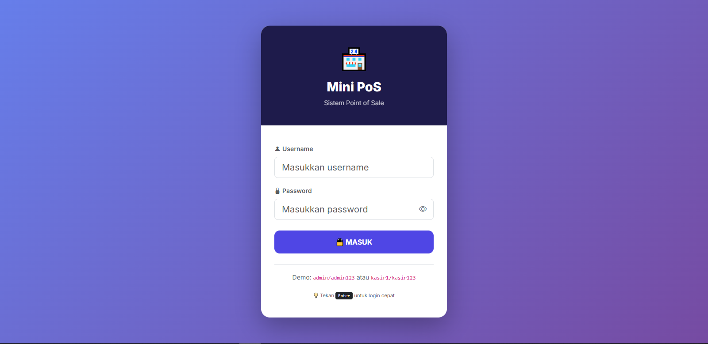

# 🏪 Mini PoS - Sistem Point of Sale Modern

[](https://php.net)
[](https://mysql.com)
[](https://getbootstrap.com)
[](LICENSE)
[](https://laragon.org)

Sistem Point of Sale (PoS) modern berbasis web dengan fitur lengkap untuk bisnis F&B, retail, dan UMKM. Dibangun menggunakan **PHP Native + Bootstrap 5 + MySQL** dengan arsitektur yang scalable dan mudah dikembangkan.



---

## ✨ Fitur Utama

### 🛒 Modul Kasir
- ✅ Pencarian produk real-time dengan shortcut **Ctrl+K**
- ✅ Keranjang belanja interaktif dengan kontrol quantity
- ✅ Multi-metode pembayaran (Tunai, QRIS, Transfer, E-Wallet)
- ✅ Cetak struk thermal (58mm/80mm) otomatis
- ✅ Notifikasi suara & toast untuk pesanan baru

### 🖥️ Self-Service Kiosk
- ✅ Halaman pelanggan tanpa login (seperti McDonald's/KFC)
- ✅ UI touch-friendly dengan animasi smooth
- ✅ Filter kategori produk (Makanan/Minuman/Snack)
- ✅ Floating cart bar dengan auto-show
- ✅ Nomor antrian otomatis
- ✅ 4 metode pembayaran terintegrasi

### 🍳 Kitchen Display System (KDS)
- ✅ Layar dapur real-time dengan auto-refresh 5 detik
- ✅ Status pesanan: Pending → Preparing → Ready → Completed
- ✅ Notifikasi suara saat pesanan baru masuk
- ✅ Live indicator dengan animasi pulse
- ✅ Color-coded card untuk status

### 📦 Manajemen Inventory
- ✅ CRUD produk lengkap
- ✅ Restock dengan audit trail
- ✅ Edit stok manual dengan catatan adjustment
- ✅ Riwayat mutasi stok (Masuk/Keluar/Adjustment)
- ✅ Peringatan stok menipis (< 10 unit)

### 👥 Manajemen User
- ✅ Role-based access (Admin & Kasir)
- ✅ CRUD user dengan avatar otomatis
- ✅ Reset password (default/custom)
- ✅ Aktifkan/nonaktifkan akun
- ✅ Proteksi admin terakhir & diri sendiri
- ✅ Show/hide password dengan icon mata
- ✅ Password strength indicator

### 📊 Dashboard & Analytics
- ✅ Statistik penjualan harian & bulanan
- ✅ Chart penjualan 7 hari terakhir (Chart.js)
- ✅ Top 5 produk terlaris
- ✅ Analisis jam sibuk (Peak Hours)
- ✅ Widget produk stok menipis

### 📜 Pusat Riwayat
- ✅ Tab Transaksi dengan filter status
- ✅ Tab Mutasi Stok dengan audit trail
- ✅ Tab Aktivitas User (admin only)
- ✅ Export-ready untuk laporan

---

## 🚀 Teknologi

| Teknologi | Versi | Keterangan |
|-----------|-------|-----------|
| PHP | 8.0+ | Backend dengan PDO |
| MySQL | 5.7+ | Database |
| Bootstrap | 5.3 | UI Framework |
| Chart.js | 4.4 | Visualisasi data |
| Bootstrap Icons | 1.11 | Icon library |
| Inter Font | - | Typography |
| Laragon | - | Local development |

---

## 📦 Instalasi

### Prasyarat
- [Laragon](https://laragon.org/download/) (recommended) atau XAMPP
- PHP 8.0 atau lebih baru
- MySQL 5.7 atau lebih baru
- Web browser modern
- nama database db_mini_pos

### Langkah-langkah

1. **Clone repository**
```bash
git clone https://github.com/username/mini-pos.git
cd mini-pos